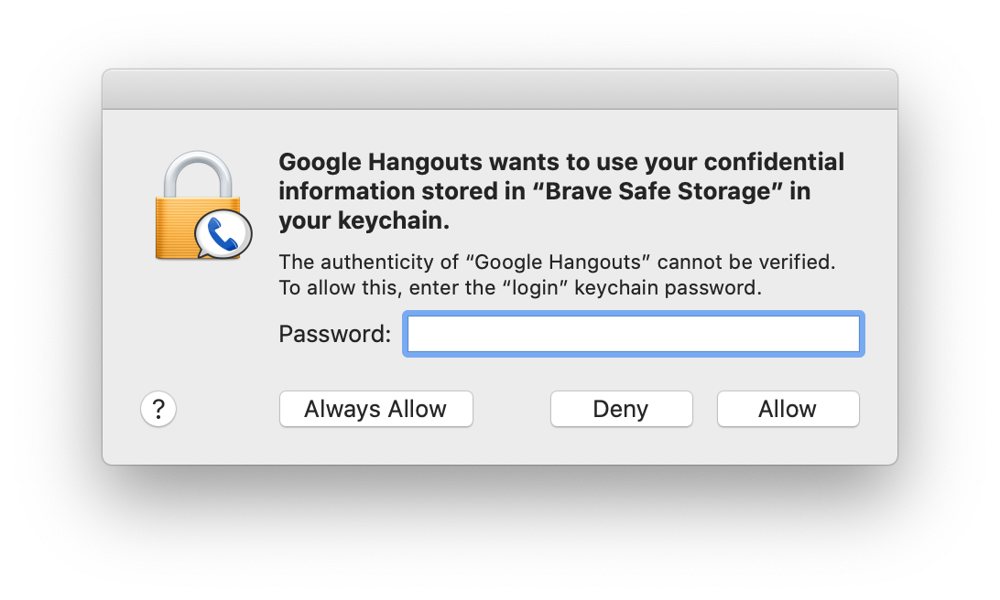
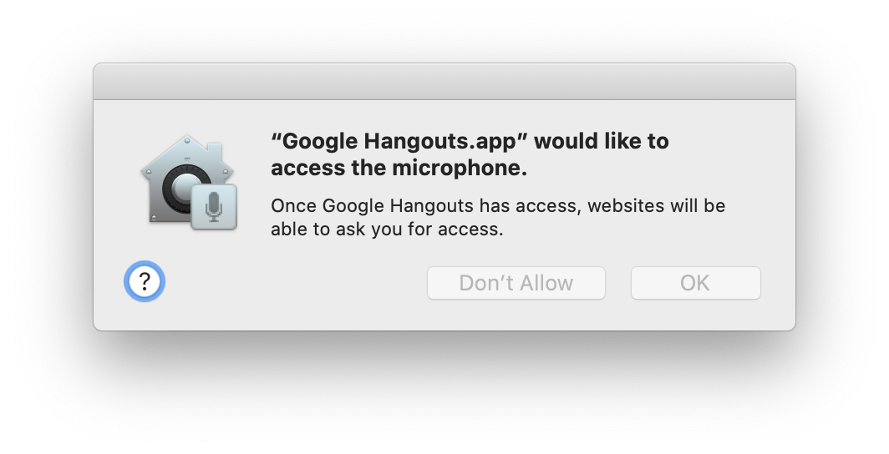

# Troubleshooting Epichrome Issues

## To find all Epichrome application IDs

```
mdfind "kMDItemCFBundleIdentifier == 'org.epichrome.app.*'"
```

## To find a specific Epichrome application ID

```
mdls -name kMDItemCFBundleIdentifier -r /Applications/<AppName>.app
```
Adjust to application installation location as necessary.

## To delete an Epichrome app:

1. Delete `/Applications/<AppName>` (or wherever you created the SSB app)
1. Delete `/Applications/Epichrome/EpichromeEngines.noindex/<User>/<AppID>`
1. Delete `~/Library/Application Support/Epichrome/Apps/<AppID>`

## Login data not saving

I never exactly figured out what combination of events caused it, but it's something to do with corrupted settings or session 
data causing Brave to not request access to Brave Safe Storage in your user keychain. The most reliable solution I've found is 
to delete _all_ of the problem apps' browser data and delete Brave Safe Storage from your keychain.
Here's how to try this with one of your misbehaving apps:

1. Delete the `UserData` directory in your app's data directory (`~/Library/Application Support/Epichrome/Apps/<AppID>/UserData`).
1. Run `Keychain Access` and search for "Brave". You should see a window like this:

1. Delete the Brave Safe Storage item.
The first time you run the app, you should most likely see a dialog like this:


If so, you should enter your login password and click `Always Allow`. 
I've found, though, that sometimes this dialog doesn't appear and yet things still work. 
There are two ways to check.

1. Once the app is running, open `Keychain Access` again and search for "Brave". 
Double-click `Brave Safe Storage` and click the `Access Control` button at the top. 
You should see something like this:

1. The definitive test then is to enter a login/password to a site that you know will 
keep you logged in (I actually use GitHub to test this) and save the password in Brave. 
Then quit the app and run it again. You should still be logged in, and if you go to 
Settings, you should see the password in your saved passwords.

## Microphone not enabled

When you first clicked the `Allow` button in the app, you should get a macOS dialog 
asking you to give the app permission? It would've looked something like this:

Sometimes that dialog takes several seconds to appear, so it's possible if you switched away from your app at 
the wrong moment or something, you could've missed it.
Anyway, if you didn't see the dialog, then for some reason Brave didn't request access from the system. If that's the case, you could try quitting the app and resetting the system mic permissions (you'll then need to give mic access back to each app you use it in the next time you run them). You can do it from the terminal like this:

```
tccutil reset Microphone
```

Then run the app again, make a call (or do anything that accesses the mic) and wait 
a few seconds, and the dialog should appear.


